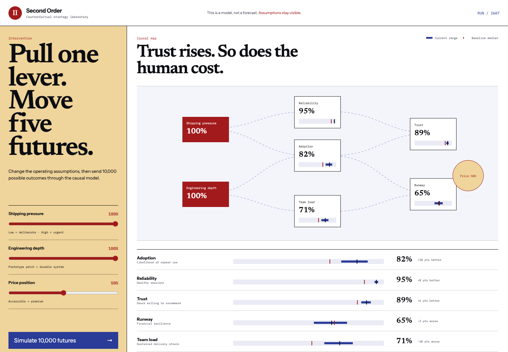

# Second Order

A counterfactual decision laboratory that treats strategy as a probability distribution, not a confident number.

Change shipping pressure, engineering depth, or price position. Second Order sends the intervention through a causal model in a Web Worker, runs 10,000 Monte Carlo trials, and compares the P10–P90 outcome range against the baseline for adoption, reliability, trust, runway, and team load.



## Why this exists

Strategy tools often hide assumptions and collapse uncertainty into a score. Second Order keeps the causal chain visible and shows how a decision can improve one outcome while making another materially worse.

## Technical highlights

- Seeded Monte Carlo simulation with Gaussian uncertainty
- Explicit causal relationships between operating levers and outcomes
- 10,000-trial computation isolated in a Web Worker
- Baseline-versus-intervention percentile visualization
- Deterministic runs for reproducible discussion and tests
- Accessible native controls and live simulation status
- Responsive causal map with a non-animated reduced-motion mode

## Run it

```bash
npm install
npm run dev
```

## Verify it

```bash
npm test
npm run build
```

Production Lighthouse: **97 performance · 100 accessibility · 100 best practices**.

## Architecture

`src/model.ts` is a pure simulation package. `src/simulation.worker.ts` runs the full model off the main thread. `src/App.tsx` coordinates requests by ID so stale worker results cannot overwrite a newer decision.

## Modelling note

The relationships are illustrative, not predictive. That limitation is part of the interface: it says “model, not forecast,” exposes the seed and percentile range, and avoids presenting one false-precision score.

## Portfolio talking point

The main product judgment was preserving trade-offs. A decision can raise trust and team load simultaneously; the interface resists turning that tension into a simplistic green score.
